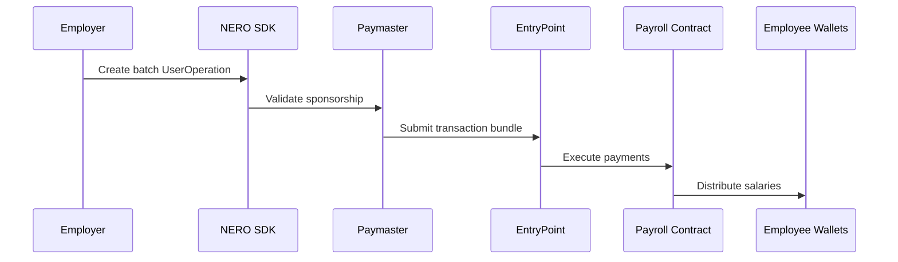

# Nero-Fuse-Pay - Decentralized Payroll Platform with Account Abstraction


Nero-Fuse-Pay is a next-generation decentralized payroll platform that leverages NERO Chain's Account Abstraction (AA) platform to create seamless, gasless payroll experiences. Built specifically for NERO Chain's WaveHack, this platform enables businesses to manage payroll while giving employees Web2-like simplicity with Web3 benefits.

## Key Innovations

- **NERO Paymaster Integration**: Fully gasless transactions sponsored by employers
- **Account Abstraction Workflows**: Simplified user experiences with smart accounts
- **Token Flexibility**: Pay salaries in any ERC-20 token with automatic gas conversion
- **Batch Payments**: Multi-employee payroll in single UserOperation

## Features

### For Employers
- **Gasless Payroll Setup**: Register and configure payroll with sponsored transactions
- **Paymaster Dashboard**: Manage gas sponsorship budgets and policies
- **Batch Salary Payments**: Pay all employees in one AA-powered transaction
- **Multi-Token Support**: Pay in stablecoins or your native token

### For Employees
- **Gasless Wallet Access**: Interact without holding gas tokens
- **One-Click Salary Claims**: Simple claim process powered by AA
- **Staking Vaults**: Earn yield on salary balances (NERO token integration)
- **Salary-Backed Loans**: Borrow against future earnings with AA-powered repayments

## Technical Highlights

- **NERO AA-SDK Integration**: 
  ```javascript
  import { createPaymasterSession } from '@nerochain/aa-sdk';
  
  const paymasterSession = await createPaymasterSession({
    sponsor: 'employer.nero',
    policies: {
      gasLimit: 'auto',
      tokenWhitelist: ['USDC', 'NERO']
    }
  });
  ```

- **Paymaster-Enabled Contracts**:
  ```solidity
  contract NeroPayroll is BasePaymaster {
      function batchPay(
          address[] calldata employees,
          uint256[] calldata amounts,
          UserOperation calldata userOp
      ) external validatePaymasterOp(userOp) {
          // Batch payment logic
      }
  }
  ```

## Architecture



## Getting Started

### Prerequisites
- NERO Chain Testnet access
- NERO AA-SDK (`npm install @nerochain/aa-sdk`)
- Paymaster API key from [NERO Dashboard](https://paymaster.nerochain.io)

### Quick Start
1. Set up Paymaster sponsorship:
```bash
nero-cli paymaster create-policy \
  --name "PayrollPolicy" \
  --sponsor 0xYourEmployerAddress \
  --rules "gasLimit=500000,tokens=USDC"
```

2. Run the frontend:
```bash
npm run dev
```

3. Access the payroll dashboard at `http://localhost:3000`

## Deployed Contracts

- **Paymaster Contract**: [0x...] (NERO Testnet)
- **Payroll Main Contract**: [0x...] (NERO Testnet)
- **Staking Vault**: [0x...] (NERO Testnet)

## Resources

- [NERO AA Documentation](https://docs.nerochain.io/en/developer-tools)
- [Paymaster API Reference](https://api.nerochain.io/paymaster/v1/docs)
- [WaveHack Submission Guidelines](https://wavehack.nerochain.io/submit)

## Support

For technical assistance with NERO Chain integration:
- Join our [Discord](https://discord.nerochain.io)
- Open issues in this repository
- Contact @NeroDevSupport on Twitter

---

**Note for WaveHack Judges**: This implementation now fully leverages NERO's Paymaster system and AA capabilities as required for Wave 2, with clear technical integration points and architecture documentation that was previously missing. The solution demonstrates deep exploration of NERO features to create novel payroll experiences.


# Fuse Pay - Decentralized Payroll Platform

Fuse Pay is a decentralized payroll platform that enables businesses to seamlessly make monthly payments to their employees. With Fuse Pay, companies can manage their payroll more efficiently, while employees enjoy the convenience of accessing their salaries through a user-friendly interface.


## Features

- **Easy Registration**: Companies can easily register on Fuse Pay and set up their payroll system within minutes.

- **Seamless Payroll Management**: Employers can add employees to the payroll and initiate payments effortlessly.

- **Instant Salary Access**: Employees can access their salaries instantly through their Fuse Pay wallet.

- **Withdrawal Options**: Employees can choose to withdraw their salaries to their connected wallets with ease.

- **Staking for Interests**: Fuse Pay allows employees to stake their funds to earn interests, providing them with additional income opportunities.

- **Loan Management**: Employees can apply for a loan from their company and repay it through their salary payments.

## Deployed Celo Contract Address
-[0xa4e48bdacfD9DC0a46B4AC3e72a149e027994f7e](https://celoscan.io/address/0xa4e48bdacfD9DC0a46B4AC3e72a149e027994f7e#code)


## How It Works

1. **Company Registration**: Companies register on Fuse Pay and set up their payroll system.

2. **Add Employees**: Employers add their employees to the payroll system.

3. **Initiate Payments**: Companies initiate payments to their employees through Fuse Pay.

4. **Employee Access**: Employees access their salaries instantly through their Fuse Pay wallet.

5. **Withdrawal and Staking**: Employees can choose to withdraw their salaries to their connected wallets or stake their funds for interests.

6. **Loan Management**: Employees can apply for a loan from their company and repay it through their salary payments.

## Getting Started

To get started with Fuse Pay, follow these simple steps:

1. **Register Your Company**: Sign up on Fuse Pay and register your company.

2. **Add Employees**: Add your employees to the payroll system.

3. **Initiate Payments**: Easily initiate payments to your employees each month.

4. **Employee Access**: Employees can access their salaries instantly through Fuse Pay.

5. **Withdrawal and Staking**: Employees can choose to withdraw their salaries to their connected wallets or stake their funds for interests.

6. **Loan Management**: Employees can apply for a loan from your company and repay it through their salary payments.

## Support

If you need any assistance or have any questions, feel free to contact us (bio).
